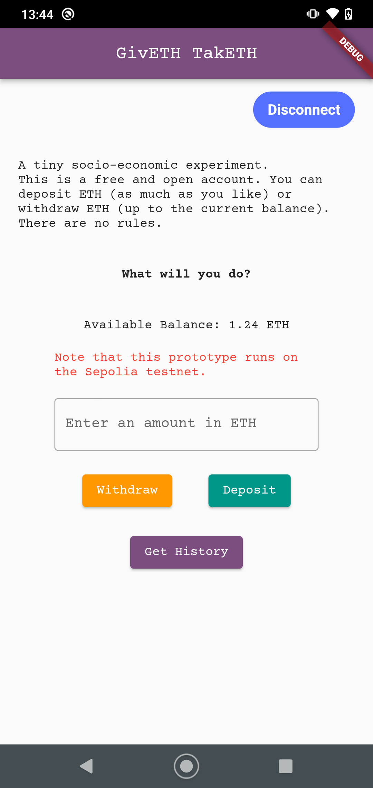

# giveth_taketh

## A note on this work in progress (during and post Hackathon) 

This dApp was initially built on a weekend during ETHBERLIN 24. I've been running into quite a few problems with the current state of support for Ethereum dApps in Flutter. 

By default a Flutter developer would first look at [web3dart](https://pub.dev/packages/web3dart), which seems to be under slow development again. This library works - I can run queries and transactions against the smart contract I deployed. However, it does only allow connecting to and signing [from a private key and a wallet file](https://pub.dev/documentation/web3dart/latest/credentials/credentials-library.html) but not from an installed wallet such as Metamask. 

This means web3dart alone works fine for testing but it is not useful by itself if you want to develop a dApp. From the provided descriptions, I did expect that this missing functionality would be provided by [Web3ModalFlutter](https://github.com/WalletConnect/Web3ModalFlutter) and that these two libraries would complement each other: 

- web3dart handles talking to the smart contract
- Web3ModalFlutter handles the Wallet connection

but [I was wrong](https://github.com/WalletConnect/Web3ModalFlutter/issues/133) - see also [this issue](https://github.com/xclud/web3dart/issues/145).

**So far I could not find a single up-to-date open source Flutter dApp that does transactions and allows signing with an installed wallet.** Blog posts and tutorials on Flutter and web3 are outdated, they reference deprecated tools like `truffle` or the abandoned `flutter_web3 repository`. I have reason to believe I was the only among 600+ hackers at ETHBERLIN to attempt build a dApp with Flutter.  
 
Therefore this code currently is a mess (a.k.a. 'hackathon architecture') and basically broken while I am trying to figure out getting these things to work. If you know of a working, up to date example that does the two minimal things necessary for a dApp in Flutter, please create an issue below.  

Here is what I am building: 



a tiny socio-economic experiment (EthBerlin hackathon)

[Description](https://projects.ethberlin.org/submissions/315)

interacts with the smart contract at address [0x8EA3C9e14694F820F11c054a630607cf59C02FAC](https://sepolia.etherscan.io/address/0x8EA3C9e14694F820F11c054a630607cf59C02FAC) on the Sepolia testnet

requires metamask or similar wallet installed on the device

dependencies: 

* [infura API](https://www.infura.io/) or another rpc node on the Sepolia testnet
* [walletconnect API](https://cloud.walletconnect.com/)
* [etherscan API](https://docs.etherscan.io/api-pro/etherscan-api-pro)

platform: Android for now (see [this issue](https://github.com/WalletConnect/Web3ModalFlutter/issues/108)). needs Android minSdk = 23

to run, enter

```
flutter run \
--dart-define CONTRACT_ADDRESS=0x8EA3C9e14694F820F11c054a630607cf59C02FAC \
--dart-define NODE_URL=<YOUR INFURA KEY> \
--dart-define WALLET_CONNECT_ID=<YOUR WALLETCONNECT ID> \
--dart-define TEST_PRIVATE_KEY=<YOUR TEST SIGNER PRIVATE KEY> \
--dart-define ETHERSCAN_KEY=<YOUR ETHERSCAN API KEY> \
--hot
```

# Open Issues 

- Metamask signing still broken, some progress
- WalletConnect Web3Modal does not work on web, see [this issue](https://github.com/WalletConnect/Web3ModalFlutter/issues/108)
- Sepolia testnet hardcoded into the app, later needs to be deployed on mainnet
- History uses the : amount of transaction needs to be figured out

# Later 

- nicer History list
- Data view (graphs)
- refactor 'hackathon architecture'